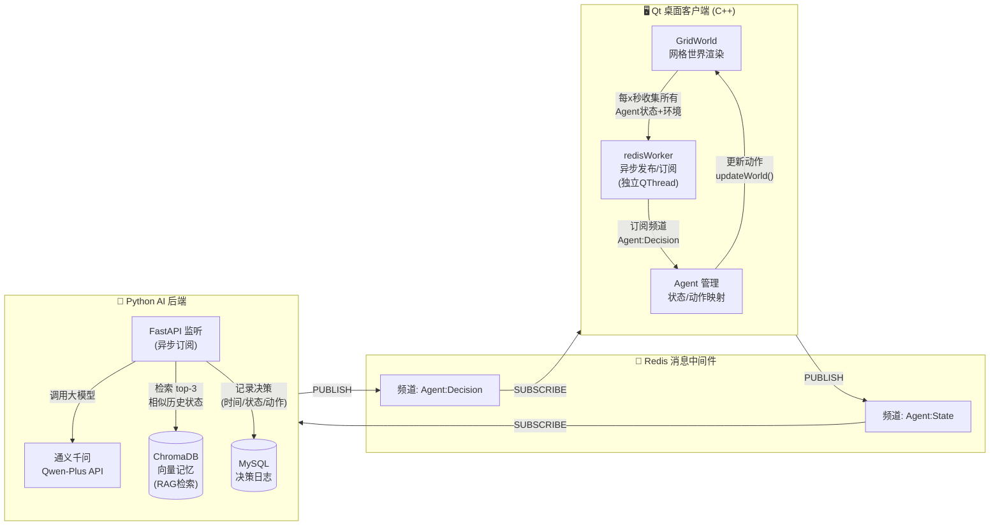

# 🧠 Agentia — 多智能体网格世界仿真平台

<div align="center">


[](https://github.com/Staypcy/Agentia)

**Qt 桌面客户端 + LLM 智能体大脑 + 实时可视化 + 分布式通信**  
**每个智能体自主决策，在网格世界中生存、工作、探索**

[📖 项目背景](#-项目背景) · [🧠 智能体与 LLM 设计](#-智能体与-llm-设计) · [🏗 系统架构](#-系统架构) · [🛠️ 技术难点](#-技术难点与解决方案) · [🚀 快速开始](#-快速开始) · [📂 目录结构](#-目录结构)

</div>

## 👋 项目背景

这是我的 **第一个 GitHub 开源项目**，目前仍是一名在读学生，正在为寻找 **Agent开发实习生** 岗位做准备。

虽然能力和经验还有限，但我尽最大努力把这个项目做好：它综合了 **C++ 桌面开发、Python 异步后端、大模型集成、分布式通信** 等实际技术栈，用来展示我的学习能力和工程兴趣。

如果你觉得项目还不错，**欢迎点一个 Star ⭐**，这对我是很大的鼓励，也是找实习简历上的重要加分项，非常感谢！

---

## 💡 智能体与 LLM 设计

### 什么是智能体 (Agent)？
在这个项目中，每个 **智能体** 是一个独立决策的程序实体。它拥有自己的状态（位置、能量、精神、资源），感知周围环境（5×5 网格内的建筑与资源），并选择一个动作来最大化自己的“生存质量”。

智能体的核心思想是：**不依靠硬编码 if/else 规则，而是让 LLM 充当“大脑”**，根据当前状态和长期记忆做出合理的动作决策。

### 动作空间
每个智能体可以在 7 个动作中选择一个（仅输出一个单词）：
- `MoveUp` / `MoveDown` / `MoveLeft` / `MoveRight`：向四个方向移动
- `Staying`：原地停留（根据所在建筑恢复能量）
- `Work`：工作（消耗能量获取资源）
- `Interact`：社交（在公园恢复精神）

### LLM 充当智能体大脑
我们用 **通义千问 Qwen-Plus** 作为决策核心。每次决策时，我们将智能体的状态和周围环境转换成一段 **自然语言提示词 (system prompt + user prompt)**，发送给大模型，并要求它只输出一个动作单词。

**关键设计点**：
1. **规则注入 Prompt**：系统提示词清晰地定义了每种动作的消耗/收益、建筑效果、移动限制等，把网格世界的物理规则写进自然语言，LLM 就像一个被规则约束的玩家。
2. **输出鲁棒性保障**：LLM 的输出可能包含多余文字，我们用正则表达式严格提取有效动作；若匹配失败则兜底为 `Staying`，避免程序崩溃。
3. **历史记忆与 RAG**：智能体的决策并非每次都“从零开始”。我们使用 **ChromaDB** 向量数据库存储历史（状态, 动作）对，当前决策前会检索最相似的 3 个历史案例，作为参考注入 Prompt（RAG）。这让智能体的行为更连贯，避免重复错误。
4. **并发控制**：多个智能体同时发出决策请求时，采用 `asyncio.Semaphore(6)` 限制并发 API 调用，防止触发千问速率限制，同时利用 `aiohttp` 异步 IO 保障吞吐。

### 为什么用 LLM 而不是写死规则？
- **开放性决策**：规则体系很难覆盖所有边界情况，LLM 能够根据上下文灵活发挥，例如“能量低时优先找超市”、“精神偏低时去公园发呆”。
- **易于扩展**：只需修改 Prompt 或记忆库，就能改变策略风格，无需重写 C++ 代码。
- **长时记忆**：传统规则智能体没有“经验记忆”，而本项目利用向量数据库实现了跨时间步的经验复用，这也是面试中常被问到的 RAG 应用场景。

---

## ✨ 核心特性

- 🧩 **清晰模块划分**：C++ 核心逻辑（`cpp/`）、Qt 可视化（`qt/`）、Python AI 后端（`py/`）职责清晰，通过 Redis 松耦合通信
- 🎨 **Qt 全栈可视化**：基于 Qt Widgets 实时渲染网格世界、多类型建筑、智能体位置与状态，右侧面板动态展示全局统计数据
- 🧠 **大模型驱动决策**：接入通义千问 Qwen-Plus，结合 ChromaDB 向量检索历史相似状态（RAG），为智能体提供长时记忆支撑
- 📡 **Redis 消息中间件**：使用 Redis Pub/Sub 实现 C++ 客户端与 Python 后端异步解耦交互，双方只关心频道消息，独立部署
- ⚡ **异步并发处理**：Redis 订阅置于独立 `QThread`，发布操作通过 `QtConcurrent::run` 异步执行；Python 端使用 `asyncio.Semaphore` 限流
- 🗄️ **全链路持久化**：每次智能体决策的完整上下文（状态、环境、动作）写入 MySQL 和 ChromaDB，支持后续行为分析与场景复现
- 🛠️ **跨平台构建**：基于 CMake 3.16+ 管理 C++ 工程，明确区分 Qt Widgets / Network / Core 模块，支持 Windows / Linux / macOS

## 🏗 系统架构



## 🛠️ 技术难点与解决方案

| 技术挑战 | 解决方案 |
| :--- | :--- |
| **C++ 与 Python 跨语言通信** | 采用 Redis Pub/Sub 作为中间层，双方只关心频道消息，无需 RPC 框架。C++ 端用 hiredis 封装异步发布/订阅，Python 端用 `redis.asyncio` 监听。 |
| **多个智能体并发决策时 LLM API 过载** | Python 端使用 `asyncio.Semaphore(6)` 限制并发数，配合 `aiohttp` 异步请求，避免触发 API 速率限制。 |
| **LLM 输出不稳定，可能返回非法动作** | 使用正则 `re.search(r'(MoveUp|MoveDown|MoveLeft|MoveRight|Staying|Work|Interact)', ...)` 从 LLM 回复中提取有效动作，兜底返回 `Staying`。 |
| **Redis 操作阻塞 Qt UI 主线程** | 订阅监听放在独立 `QThread` 中（`redisMessager` 移动到子线程）；发布操作通过 `QtConcurrent::run` 异步执行，避免界面卡顿。 |
| **C++ 与 Python 之间状态数据格式一致性问题** | 定义统一的 JSON Schema：每个智能体携带自身状态 + 周围 5x5 网格信息，确保双方解析一致。 |
| **智能体长期记忆与上下文利用** | 使用 ChromaDB 存储历史状态-动作对，每次决策前检索 top-3 相似案例注入 LLM prompt，提升决策稳定性和连续性。 |

## 🚀 快速开始

### 环境要求

| 模块 | 版本要求 |
| :--- | :--- |
| Qt | 6.x (Widgets, Network, Core) |
| CMake | 3.16+ |
| C++ 编译器 | 支持 C++17 |
| Redis | 7.x (运行在 localhost:6379) |
| Python | 3.10+ |
| MySQL | 8.0 |

### 1. 克隆仓库
```bash
git clone https://github.com/Staypcy/Agentia.git
cd Agentia
```

### 2. 启动基础服务
```bash
# 启动 Redis
redis-server

# 启动 MySQL（确保 agentia_db 数据库已创建）
mysql -u root -p -e "CREATE DATABASE IF NOT EXISTS agentia_db;"
```

### 3. 运行 Python AI 后端
```bash
cd py
pip install fastapi uvicorn aiohttp redis[hiredis] chromadb sentence-transformers pymysql

# 设置环境变量（不要硬编码在代码里！）
export DASHSCOPE_API_KEY="你的阿里云API Key"
export MYSQL_PASSWORD="你的MySQL密码"

uvicorn main:app --host 0.0.0.0 --port 8000
```
> 首次启动会自动创建 MySQL 表 `decision_logs_agentia_history` 和 ChromaDB 向量集合。

### 4. 编译运行 Qt 客户端
```bash
mkdir build && cd build
cmake ..
cmake --build .
./Agentia
```

### 5. 开始仿真
- 点击界面上的 **PushButton** 添加智能体
- 系统每 4 秒自动通过 Redis 向 AI 后端发送所有智能体的状态，并接收决策指令
- 右侧面板实时显示智能体数量、能量统计、世界资源分布

## 📂 目录结构

```
Agentia/
├── cpp/                        # C++ 核心逻辑
│   ├── Agent.cpp / .h          # 智能体定义（状态、决策、移动）
│   ├── NetWorkManager.cpp / .h # 网络管理器（LLM API 备用调用）
│   ├── redisworker.cpp / .h    # Redis 连接、异步发布订阅
│   └── redismessager.cpp / .h  # Redis 订阅线程封装
├── qt/                         # Qt 可视化层
│   ├── main.cpp                # 应用程序入口
│   ├── mainwindow.cpp / .h / .ui # 主窗口（布局集成）
│   ├── gridworld.cpp / .h      # 网格世界绘制与更新
│   └── datadisplay.cpp / .h    # 自定义数据展示组件
├── py/                         # Python AI 后端
│   ├── main.py                 # FastAPI 服务、Redis 监听、LLM 调用
│   └── test_main.http          # HTTP 接口测试文件
├── CMakeLists.txt              # CMake 构建配置
└── README.md
```

## 🔮 未来规划

- [ ] 支持本地部署的 LLM（Ollama / llama.cpp），减少 API 依赖
- [ ] 实现智能体之间的直接交互（赠送资源、社交）
- [ ] 提供 Docker Compose 一键启动全部服务
- [ ] 增加 Web 前端可视化替代方案，实现跨平台浏览器访问
- [ ] 集成 Grafana 数据看板，可视化分析历史决策

## 📄 许可证

本项目采用 [MIT License](LICENSE)。

---

*如果这个项目对你有些许启发，请不要吝啬你的 Star ⭐，这对一个找实习的学生来说意义重大，谢谢！*
```
